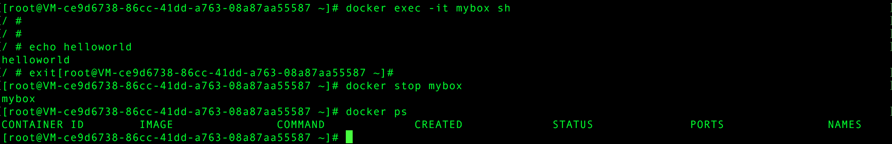
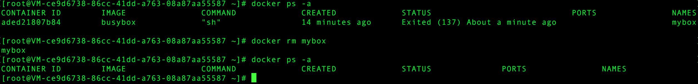

# Docker笔记

**参考:**

[Docker的安装配置及使用详解](http://blog.csdn.net/fgf00/article/details/51893771)

[极客学院](http://wiki.jikexueyuan.com/project/docker/installation/centos.html)

---

## 1. 搭建docker环境
### 1.1 centos系统

```
yum install -y epel-release
yum install docker-io
```

docker的配置文件地址：`/etc/sysconfig/docker`

### 1.2 ubuntu系统

```
wget -qO- https://get.docker.com/ | sh 
// q后面是大写字母O
```

ubuntu系统的配置文件在：`/etc/default/docker`

### 1.3 加入开机启动服务

```
chkconfig docker on
service docker start
```
### 1.4 mac os 系统

安装`boot2docker`，一个微型Linux系统。


## 2. 镜像
### 2.1 下载镜像

> 镜像源地址：hub.docker.com

```
#查看docker基本信息
docker version    

#下载一个centos的镜像
docker pull centos

#下载完成后查看镜像信息
docker images centos

#查看所有镜像
docker images
```

### 2.2 使用镜像

```
#使用镜像centos，进入-bash命令行
sudo docker run -i -t centos /bin/bash
```

> 公共镜像源由docker官方提供，更改不了源地址，但是可以添加国内镜像库加速。私有源库的创建见后文

### 2.3 删除镜像
`# docker rmi images:v1`

## 3 容器

**容器与镜像的关系**：镜像不能直接执行，需要先依照镜像创建一个容器，然后run创建的容器，执行相关程序。

镜像可以创建多个容器，一个容器只能执行一个镜像

### 3.1 下载一个镜像busybox

`# docker pull busybox`


### 3.2 利用busybox镜像，创建一个名为mybox的容器

```
# docker create -it --name=mybox busybox sh
```


可以看到使用`docker ps`命令查看正在运行的容器中没有mybox容器，而使用命令`docker ps -a`查看所有容器时可以看到我们刚刚创建的mybox容器。说明上面的操作只是创建了容器，而没有运行(run)起来。

### 3.3 执行mybox容器

`# docker start mybox` ， 然后使用`# docker ps`命令


### 3.4 进入容器中使用shell命令

`# docker exec -it mybox sh`


### 3.5 停止容器
`# docker stop mybox`



### 3.6 删除容器
`# docker rm mybox`



---

**TIPS**

1. 创建容器的时候需要在镜像名(busybox)添加sh等命令，不能添加ls等命令。因为ls命令执行完进程就关闭了，容器也就跟着关闭了。而sh命令这不会关闭进程。添加-it命令就会是run状态。

2. 上面的1、2、3、4步可用一段命令来代替

```
docker run -it --name testbox busybox sh
```


3. 创建mysql容器

```
docker run -it --name mysqlsrv1 -p 3306:3306 -e MYSQL_ROOT_PASSWORD=123456 mysql
```

和

```
docker exec -it mysqlsrv1 bash
mysql -uroot -p123456
show databases;
```

## 4. 容器与主机的文件映射

```
docker run -v /docker/v:/docker busybox sh
```


## 5. 镜像的导入和导出

导出镜像：`# docker save -o mybox.tar busybox`

导入镜像：`# docker load --input mybox.tar`

## 6. 部署私有仓库

部署私有仓库需要用到镜像registry，然后创建一个容器，然后再映射镜像的存储空间。

### 6.1 下载registry镜像

`#docker pull registry:2.4.1`

### 6.2 配置容器

```
docker run -d -v /opt/registry:/var/lib/registry -p 5000:5000 --restart=always --name registry registry:2.4.1
```

-d与-it 对应，在后台执行。
### 6.3 仓库相关配置
修改docker配置文件，增加非安全访问的私有库地址。

**ubuntu**:

路径`/etc/docker/`下新建文件`daemon.json`
添加：

```
{
	"insecure-registries":["10.3.10.54:9000"],
	"registry-mirrors": ["https://docker.mirrors.ustc.edu.cn"]
}
```

然后重启docker服务：`service docker restart`

添加国内镜像加速：
在文件`/etc/default/docker`中修改为：
```
DOCKER_OPTS='--registry-mirror https://registry.aliyuncs.com'
```

### 6.4 对私有库上传和下载镜像

上传镜像到私有库：

```
docker tag busybox 192.168.212.128:5000/busybox
docker push 192.168.212.128:5000/busybox
```

查看私有库列表：

```
curl http://192.168.212.128:5000/v2/_catalog
```

从私有库下载镜像：

```
docker pull 192.168.212.128:5000/busybox
```

## 7. 创建镜像
### 7.1 使用commit打包容器

将本地已有的容器打包成一个镜像

```
docker commit mybox mybox_image:v1
```

### 7.2 使用Dockerfile制作镜像


