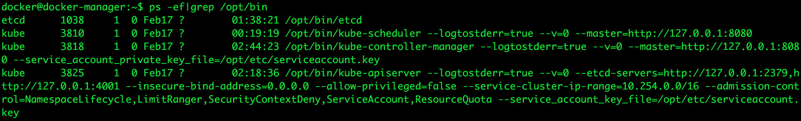
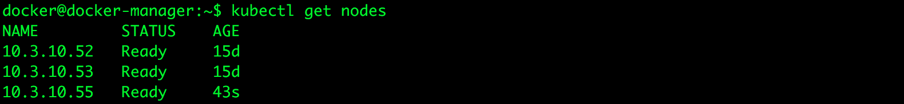
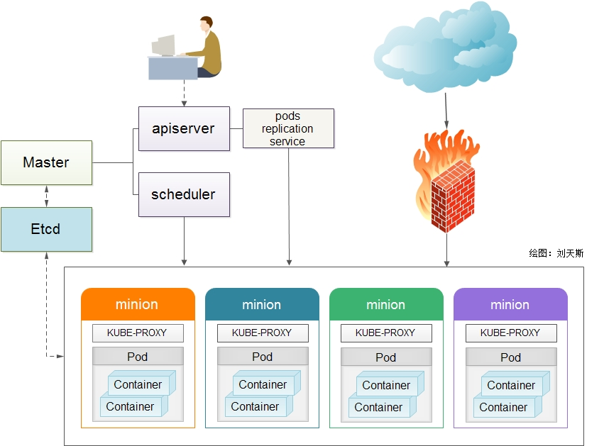

# Docker集群K8S环境搭建

## 搭建Kubernetes环境

### master节点
#### 安装：
在`10.3.10.51`的虚拟机上，将kubernetes编译好的二进制文件拷贝到`/tmp/`目录下，进入`master`目录，然后执行`setup.sh`脚本。脚本如下：

```bash
sudo mkdir -p /opt/bin/
sudo mkdir -p /opt/etc/

dirname=$(dirname $0)
sudo cp $dirname/bin/* /opt/bin/
sudo cp $dirname/etc/* /opt/etc/

sudo chmod +x /opt/bin/*

sudo useradd etcd
sudo mkdir -p /var/lib/etcd
sudo chown -R etcd /var/lib/etcd

sudo useradd kube
sudo mkdir -p /var/run/kubernetes
sudo chown -R kube /var/run/kubernetes

sudo cp $dirname/systemd/* /lib/systemd/system/
sudo systemctl unmask etcd kube-apiserver kube-controller-manager kube-scheduler
sudo systemctl enable etcd kube-apiserver kube-controller-manager kube-scheduler
sudo systemctl start etcd kube-apiserver kube-controller-manager kube-schedule
```

其中，kubernetes相关组件服务在`/opt/bin/`目录下。配置文件在`/opt/etc/`目录下。

#### 配置：
修改`/opt/etc/config`文件：

```bash
KUBE_LOGTOSTDERR="--logtostderr=true"

# journal message level, 0 is debug
KUBE_LOG_LEVEL="--v=0"

# Should this cluster be allowed to run privileged docker containers
KUBE_ALLOW_PRIV="--allow-privileged=false"

# How the controller-manager, scheduler, and proxy find the apiserver
KUBE_MASTER="--master=http://127.0.0.1:8080"
DOCKER_OPTS="--insecure-registry 10.3.10.54"
```

使用命令`ps -ef`查看相关进程是否启动`etcd`、`kube-apiserver`、`kube-controller-manager`、`kube-scheduler`。



#### **kuberctl**环境变量配置：`vi ~/.bash_profile`
添加

```bash
PATH=$PATH:/opt/bin
export PATH
```

然后重新编译配置文件`source .bash_profile`。

这样，kubernetes中的master管理节点就配置完成。

### minion节点

minion节点，现在统称为`node`节点。
在`10.3.10.52`、`10.3.10.53`、``10.3.10.55`的虚拟机上，将kubernetes编译好的二进制文件拷贝到`/tmp/`目录下，进入`minion`目录，然后执行`setup.sh`脚本。脚本如下：

```bash
sudo mkdir -p /opt/bin/
sudo mkdir -p /opt/etc/

dirname=$(dirname $0)
sudo cp $dirname/bin/* /opt/bin/
sudo cp $dirname/etc/* /opt/etc/

sudo chmod +x /opt/bin/*

sudo useradd kube
sudo mkdir -p /var/lib/kubelet

sudo cp $dirname/systemd/* /lib/systemd/system/
sudo systemctl unmask kubelet
sudo systemctl enable kubelet
```

修改配置文件：
`/opt/etc/config`:

```bash
KUBE_MASTER="--master=http://10.3.10.51:8080"
```

设置为master主机地址。

`/opt/etc/kubelet`:

```bash
###
# kubernetes kubelet (minion) config

# The address for the info server to serve on (set to 0.0.0.0 or "" for all interfaces)
KUBELET_ADDRESS="--address=10.3.10.52"

# The port for the info server to serve on
# KUBELET_PORT="--port=10250"

# You may leave this blank to use the actual hostname
KUBELET_HOSTNAME="--hostname-override=10.3.10.52"

# location of the api-server
KUBELET_API_SERVER="--api-servers=http://10.3.10.51:8080"

# Add your own!
KUBELET_ARGS=""
```

然后查看kubelet进程。若没有启动，则手动启动`service kubelet start`

在管理节点master上查看node状态`kubectl get nodes`:



自此kubernetes环境搭建成功。包含一个管理节点master，三个node节点。

## Kubernetes相关组件



etcd : `etcd -version`查看etcd版本

kubectl: `kubectl version`查看kubectl版本

## Kubernetes服务管理


## 参考文档

[基于kubernetes构建Docker集群管理详解](http://blog.liuts.com/post/247/)