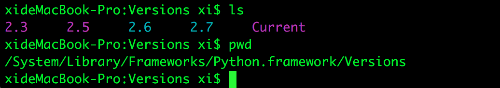
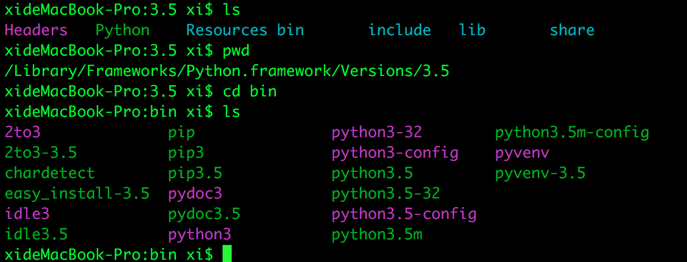
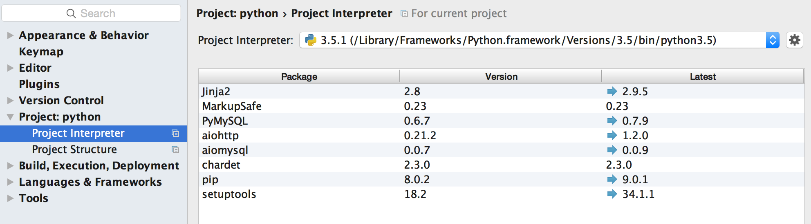
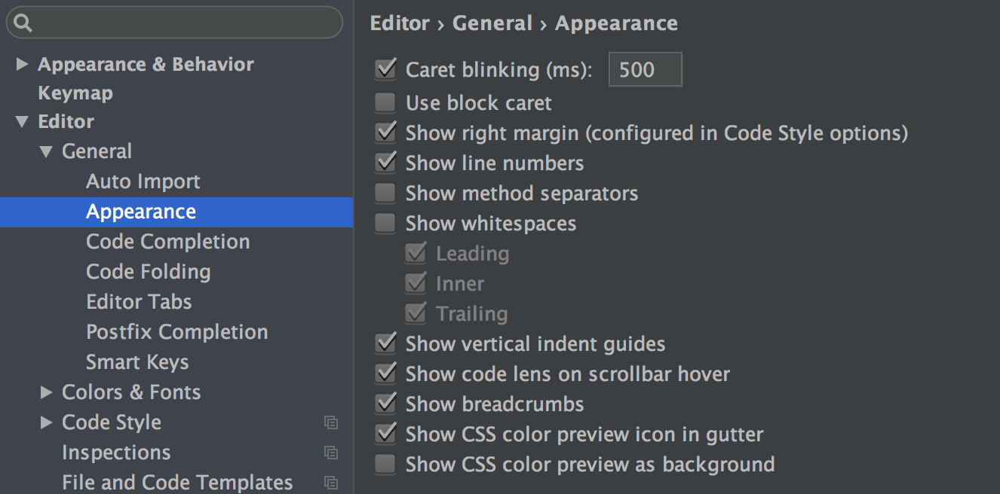
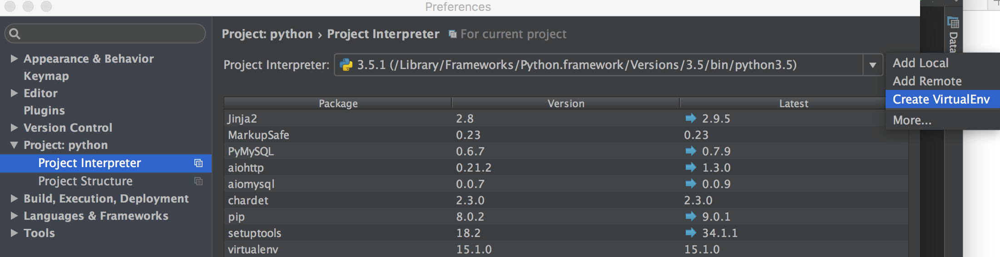

# Python 学习笔记

## Python 环境安装

### Os x

本身mac os自带python,路径为：

```
/System/Library/Frameworks/Python.framework/Versions/
```


用户安装的python环境默认在：

```
/Library/Frameworks/Python.framework/Versions/
```


解释器都在对应版本的`./bin/`目录下。

用户安装Anaconda集成环境后，python环境在：

```
/Users/steven/Anaconda3
```

或

```
/Users/steven/Anaconda3
```

目录下。

---

对于以上环境，可以在python中用以下脚本执行查询包得路径：

```python
import sys

print('\n'.join(sys.path))
```

python环境启动命令存储路径：

1. Mac系统自带的python环境默认启动路径在：/usr/bin
2. 用户安装的python环境默认启动路径在：/usr/local/bin
3. 第三方的 python 环境，比如 anaconda 中的 python 环境，默认启动配置在文件中，通常为：~/.bash_profile (.bash_profile 是在bash（默认的 shell 环境下）的配置文件，像我的电脑现在是 zsh 的 shell 环境，配置文件为.zshrc)

输入 python 命令是：会按照321的顺序查找含有 python 可执行文件，并执行。
该顺序同样适用于，mac 下所有的可执行命令的查找顺序！！！

修改默认python启动路径:修改配置文件`~/.bash_profile`

```python
alias python="/Library/Frameworks/Python.framework/Versions/3.5/bin/python3.5"
```

然后编译以下配置文件`source ~/.bash_profile`

参考文档：[mac下的python相关问题](http://blog.csdn.net/u010692239/article/details/52701626)

安装不同纯净的python环境virtualenv

参考文档：[virtualenv](http://www.liaoxuefeng.com/wiki/0014316089557264a6b348958f449949df42a6d3a2e542c000/001432712108300322c61f256c74803b43bfd65c6f8d0d0000)

1. 使用`pip`安装virtualenv

```bash
$ pip3 install virtualenv
```

2. 在指定目录下创建独立的python运行环境

```bash
cd /Library/Frameworks/Python.framework/Versions/3.5/lib/python3.5/site-packages
python3 virtualenv.py /Users/xi/Documents/python/flask
```
参数`--no-site-packages`创建一个纯净的python环境，不继承本机pip安装的包

查看pip3的包的安装目录

`$ pip -V`

3. 进入虚拟环境

`source flask/bin/activate`

退出

`deactivate`


### Ubuntu
### Centos
### Windows
### Python集成环境Anaconda3

## Python 版本更新

## Python 基本语法

### 变量
### 语法块
### 流程

## Python Web开发

### 常用框架

## PyCharm使用

### 环境配置

选择本地python版本



显示行号



创建一个virtualenv环境




